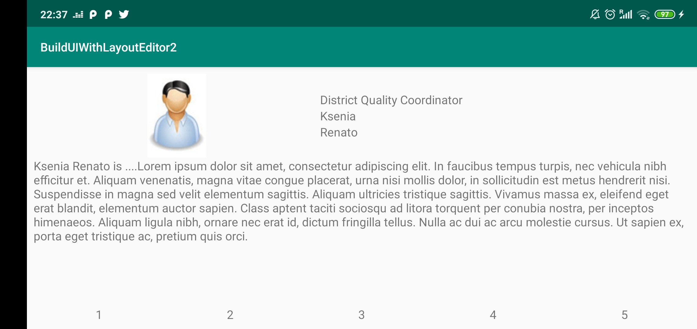
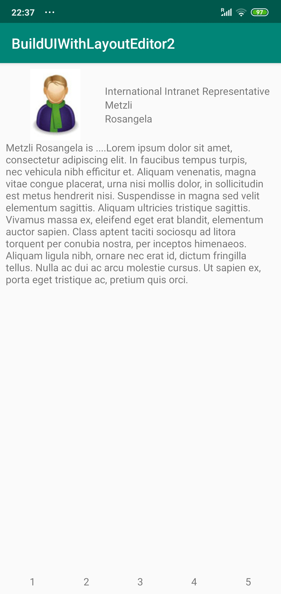

# Android Application Development Course

## BuildUIWithLayoutEditor2

Add View, components, employee data.

[**JAMK Course**](http://ttow0625.pages.labranet.jamk.fi/android-application-development/)

Exercises for University.

## Preview

**Landscape**

**Portrait**

